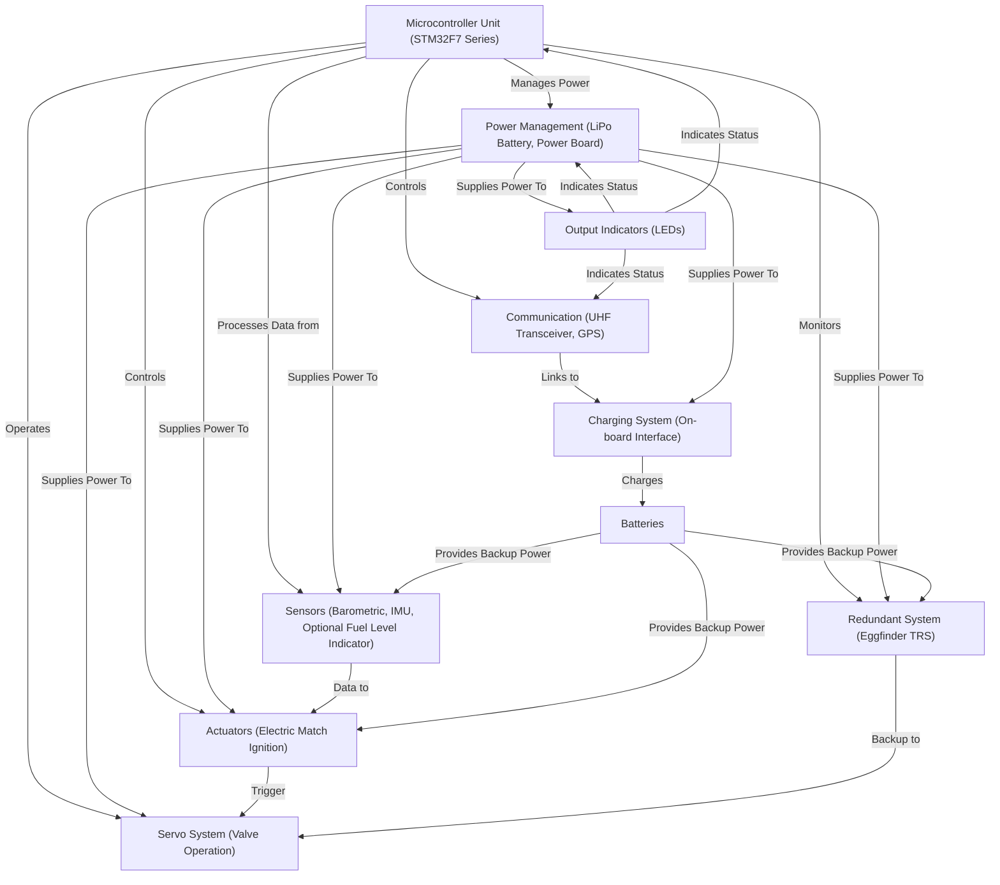

# Astrea - Team Void

## Project Overview
This repository contains the code for Team Void's rocket electronics system, designed for the European Rocketry Challenge (EuRoC). The system manages navigation, power, and communication functionalities essential for rocket operation.

## System Architecture




Our rocket's electronics system centers around a main microcontroller unit (MCU) with a backup redundant controller and with several modules:

### Microcontroller Unit (MCU)
- **Type:** STM32F466
- **Description:** Serves as the primary micro-controller.

### Communication
- **Components:** UHF Transceiver (LoRa), GPS Tracking (Ublox NEO-6M)
- **Function:** Provides long-range telemetry and precise GPS positioning.

### Power Management
- **Components:** LiPo Battery, Power Distribution Board
- **Function:** Manages power distribution and voltage regulation to ensure stable operation.

### Sensors
- **Components:** Barometric Sensor (BMP280), IMU (MPU-6050), Optional Fuel Level Indicator
- **Function:** Vital for determining altitude and maintaining vehicle stability.

### Actuators
- **Components:** Electric match ignition system
- **Function:** Activates the parachute deployment at predetermined altitudes for safe recovery.

### Redundant System
- **Components:** Eggfinder TRS
- **Function:** Enhances mission reliability with backup GPS and altitude logging.

### Batteries
- **Description:** Extra battery packs to support extended operations and emergency scenarios.

### Charging System
- **Description:** Facilitates on-board charging of the main and auxiliary batteries.

### Output Indicators
- **Description:** LEDs that provide visual feedback on the system's operational status.

## Team Members

1. Daniel 
2. Mat 
3. Ismail 
4. Yassin 

# Project Setup Guide

## URefrences and detailed guides could be found here:

https://dev.to/pgradot/cmake-on-stm32-the-beginning-3766
https://www.catsystems.io/vega
https://github.com/catsystems/cats-embedded

For quick setup and to get started with this project using VS code, clone this repository to your local machine using:

```bash
git clone https://github.com/danielsalyi/Astrea
```

## Setting Up Your Environment

1. **Install cmake:** 
    - Download and install from [Cmake download](https://cmake.org/download/).
    - For windows, it is recommended to choose the installer under binary distrubutions. MAKE SURE to add the cmake to path during the installation, you will be prompted for that.
    - If you are using linux, I assume that you already know what to do to install cmake \_(-_-)_/
    - You can verify installation by running `cmake --version` in the terminal,cmd or powershell depending on which os you are using

2. **Install the ARM Toolchain:**
   - Windows: Download and install from [GNU Arm Embedded Toolchain](https://developer.arm.com/downloads/-/arm-gnu-toolchain-downloads).
   - macOS and Linux: Use package managers like Homebrew or apt to install the ARM GCC compiler.
   - Since we are using Nucleo-F446RE, download the arm-none-eabi tool-chain which is for bare-metal environment (without operating syste)
   - For windows, also MAKESURE to add to path, will be in the last step before pressing finish in the windows installation
   - You can verify installation by running `arm-none-eabi-gcc --version` in the terminal,cmd or powershell depending on which os you are using

3. **Install Required VS Code Extensions:**
   - **C/C++**: Provides IntelliSense and debugging support.
   - **Cortex-Debug**: Enables debugging STM32 devices directly from VS Code.
   - **statusbar-commands**: Makes workflow easer
   - **CMAKE**: Cmake to build project 

4. **OpenOCD download**
   - Go to the [Link](https://gnutoolchains.com/arm-eabi/openocd/)
   - download latest zip
   - unzip to programfiles or somewhere u want to
   - go to enviroment variables and add <your-path>/openocd/bin to the path


## Opening the Project in VS Code

1. **Launch Visual Studio Code.**
2. **Open the Project:**
   - Go to `File > Open Folder...`
   - Navigate to the directory where you've cloned the repository and click `Open`.

3. go to tasks.json and add:

```json
"tasks": [
		{
			"label": "Flash",
			"type": "shell",
			"command": "./scripts/openocd/flash.sh",
			"problemMatcher": []
		}
	]
```

4. go to settings.json (if you dont have it, go to the statusbar-commands settings, and find it there...),
and copy to the end:

```json
"statusbar_command.commands": [
        {
            "text": "$(symbol-event)Flash",
            "id": "runTask",
            "name": "runTask",
            "command": "workbench.action.tasks.runTask",
            "arguments": [
                "Flash"
            ]
        }
    ]
```

## Compiling and Uploading the Code

1. **Building the Project:**
   - If you have cmake extension installed, you can click on the clog, and it will build the project.
   - Build for all

2. **Building the Project:**
   - Click on the flash to run the flash
   - Ensure your Nucleo board is connected to your PC.

     you can configure the statusbar with this tutorial
     https://github.com/microsoft/vscode-cmake-tools/issues/3423


# Common problems
