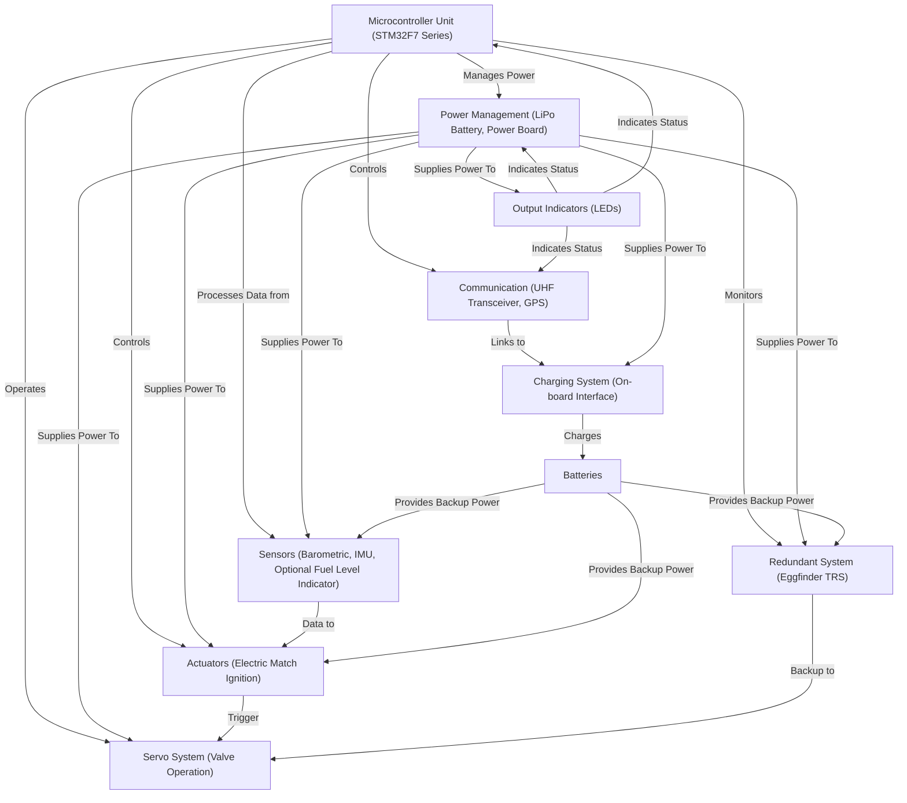

# Astrea

## Useful links:

https://dev.to/pgradot/cmake-on-stm32-the-beginning-3766
https://www.catsystems.io/vega
https://github.com/catsystems/cats-embedded

# Team Void - Electronics overview

## Project Overview
This repository contains the code for Team Void's rocket electronics system, designed for the European Rocketry Challenge (EuRoC). The system manages navigation, power, and communication functionalities essential for rocket operation.

## System Architecture




Our rocket's electronics system centers around a main microcontroller unit (MCU) with a backup redundant controller and with several modules:

### Microcontroller Unit (MCU)
- **Type:** STM32F7 Series
- **Description:** Serves as the primary controller for navigation, sensor data processing, and actuator management.

### Communication
- **Components:** UHF Transceiver (LoRa), GPS Tracking (Ublox NEO-6M)
- **Function:** Provides long-range telemetry and precise GPS positioning.

### Power Management
- **Components:** LiPo Battery, Power Distribution Board
- **Function:** Manages power distribution and voltage regulation to ensure stable operation.

### Sensors
- **Components:** Barometric Sensor (BMP280), IMU (MPU-6050), Optional Fuel Level Indicator
- **Function:** Vital for determining altitude and maintaining vehicle stability.

### Actuators
- **Components:** Electric match ignition system
- **Function:** Activates the parachute deployment at predetermined altitudes for safe recovery.

### Redundant System
- **Components:** Eggfinder TRS
- **Function:** Enhances mission reliability with backup GPS and altitude logging.

### Batteries
- **Description:** Extra battery packs to support extended operations and emergency scenarios.

### Charging System
- **Description:** Facilitates on-board charging of the main and auxiliary batteries.

### Output Indicators
- **Description:** LEDs that provide visual feedback on the system's operational status.

## Team Members

1. Daniel - Team leader and focuses on PCB design, microcontroller programming and integration.
2. Mat - Responsible for Simulation, programming and testing..
3. Ismail - Specializes in power management and programming.
4. Yassin - Programming and testing.

## Getting Started
To get started with this project, clone this repository to your local machine using:

```bash
git clone https://github.com/your-repository-url.git

TODO: add project build instructions
